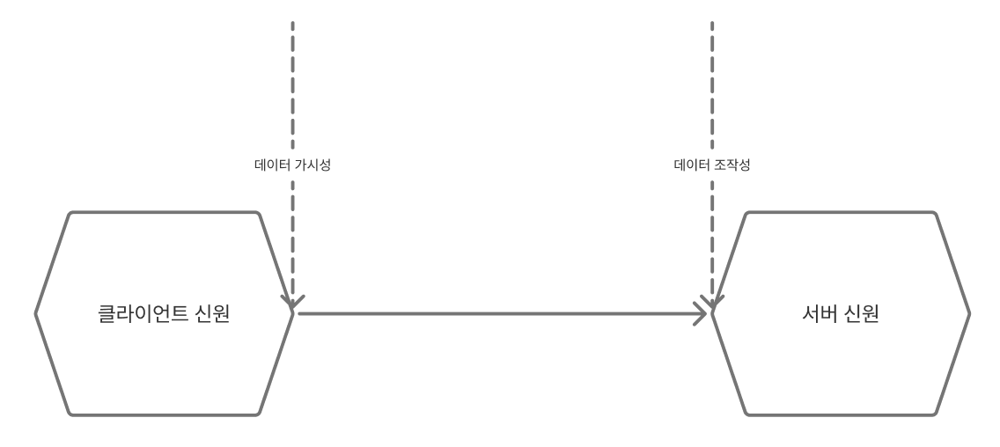
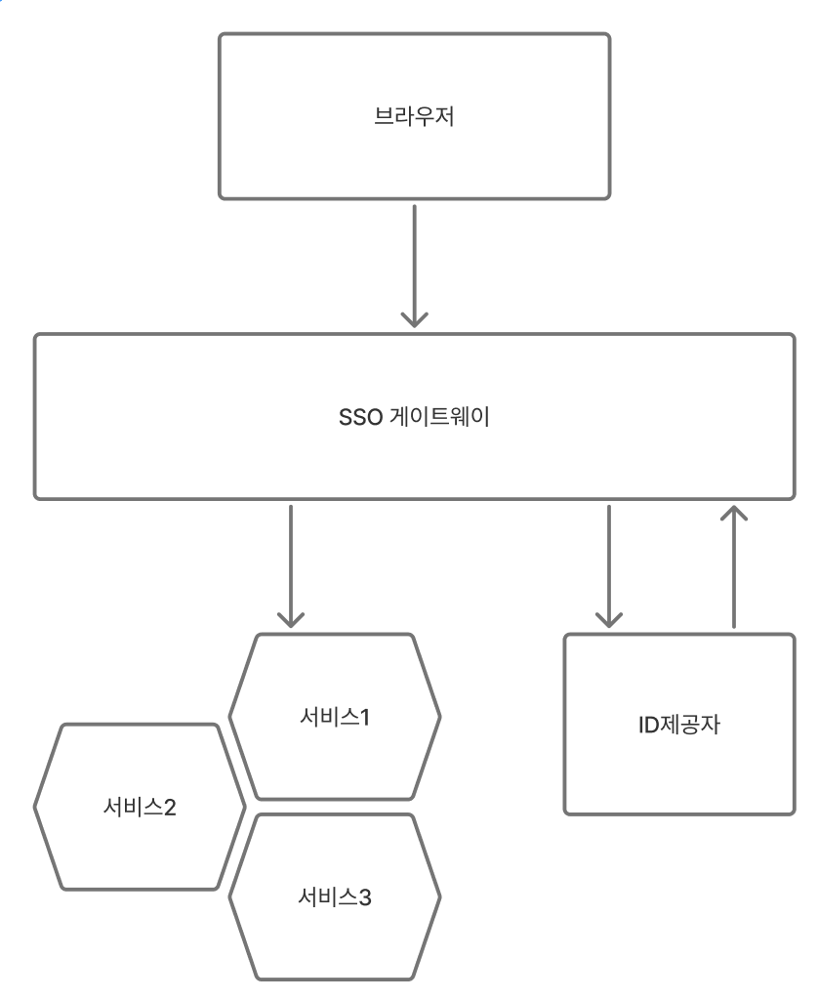
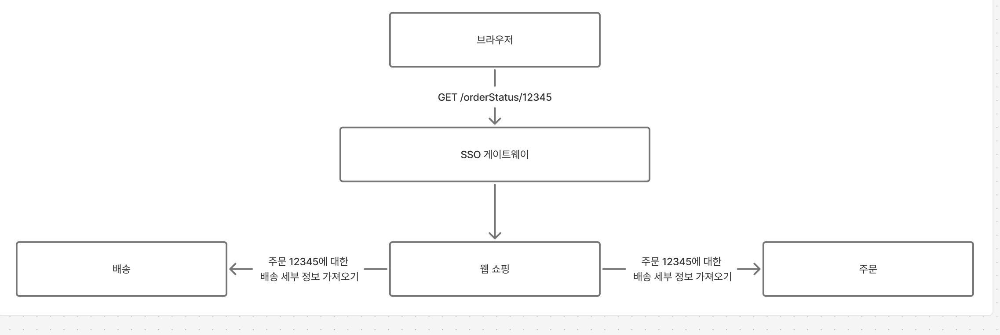
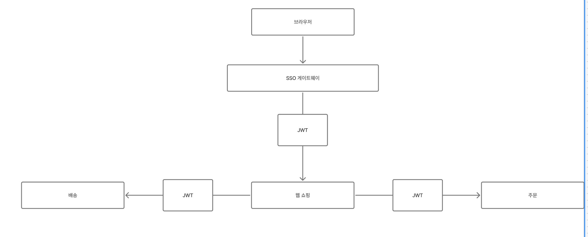

# 11장. 보안

### 핵심 원칙

- 보안 문제는 가장 안전하지 않은 측면만큼 안전하다.
  - 정문 보안에만 신경 쓰지 말라

### 최소 권한의 원칙

- 개인, 외부, 내부 시스템 등에 액서스 권한을 부여할 때 부여하는 액서스 권한에 주의를 기울어야 한다.
  - 최소 권한 원칙에 따라 당사자기 필요한 기능을 수행할 때 필요한 액서스 권한을 필요한 기간동안만 제공

### 심층 방어

- 공격자로부터 여러 보호 수단을 갖추는 것이 중요하다.

> 보안 통제 유형
>
> - 예방형 : 공격이 발생하지 않도록 한다. (시크릿을 안전히 저장하고 저장 및 전송 중인 데이터를 암호화 하고 적절한 인증 및 권한 부여 매커니즘을 구현한다.)
> - 탐지형 : 공격이 발생하고 있거나 발생했다는 사실을 알려준다.
> - 대응형 : 공격 중 또는 공격 후 대응을 돕는다. 시스템을 재구축하는 자동화된 매커니즘, 데이터 복구를 위한 백업 작업, 사고 발생시 적절한 의사소통 계획 수립

### 자동화

- 자동화를 통해 인적 오류를 줄이고 최소 권한 원칙을 더 쉽게 구현할 수 있다.

### 사이버 보안의 다섯가지 기능

- 식별
- 보호
- 감지
- 대응
- 복구

## 애플리케이션 보안의 기초

### 자격 증명

- 사람 또는 컴퓨터에게 어떤 형태의 제한된 자원에 대한 액서스 권한을 부여
- 자격 증명은 2가지 주요 영역으로 나눌 수 있다.
  - 시스템 사용자의 자격 증명
  - 시크릿
    - ex) TLS용 인증서, SSH, 공개/비공개 API 키 쌍, 데이터베이스 액서스를 위한 자격증명
    - 고려사항
      - 생성 : 처음에 시크릿을 어떻게 만드는가?
      - 배포 : 시크릿이 생성된 뒤, 올바른 장소에만 전달될 수 있도록 하는가?
      - 저장 : 권한을 가진 당사자만 액서스할 수 있도록 시크릿이 저장되어 있는가?
      - 모니터링 : 이 시크릿이 어떻게 사용되고 있는지 알고 있는가?
      - 교체 : 문제없이 시크릿 변경이 가능한가?

#### 교체

- 자격 증명을 자주 교체하여 누군가 자격 증명에 액서스 했을 때 피해를 제한할 수 있어야 한다.
  - 시간 제한이 있는 자격 증명을 생성
  - 자격 증명 범위를 제한하여 교체의 잠재적인 영향을 줄일 수 있다.

### 패치

- 스니크, 깃허브 코드 스캐닝을 통해 취약점이 있는 라이브러리 사용시 경고를 받을 수 있다.
  - 이상이 발생하면 최신 패치 버전으로 업데이트 하는데 도움이 되는 pull요청을 받을 수 있음

### 백업

- 중요한 데이터를 복제한다.
- 백업 시 현장과 멀리 떨어진 장소에 백업을 보관해야 한다.

## 암묵적 신뢰 대 제로 트러스트

### 암묵적 신뢰

- 경계 내부에서 만들어진 서비스에 대한 호출을 암묵적으로 신뢰한다고 가정
- 공격자가 내부 네트워크로 들어오면 문제가 커진다.

### 제로 트러스트

- 이미 침해된 환경에서 작업하고 있다고 가정하는 것

### 스팩트럼

- 암묵적 신뢰를 사용할지 제로 트러스트를 사용할지에 대해 액세스할 정보의 민감도에 따라 결정할 수 있다.

#### 예시 ) 메디컬코

- 공개 정보
- 비공개 정보
- 비밀 정보

마이크로서비스는 사용하는 가장 민감한 데이터를 기준으로 제어를 실행한다.
(공개 데이터를 사용하는 마이크로 서비스는 공개 데이터만 사용 가능하고, 비공개, 공개 데이터를 사용하는 마이크로서비스는 비공개 영역에서 실행되어야 한다. )

## 데이터 보안

### 전송 중인 데이터

- 서버 신원

  - 대화 중인 서버가 정확히 누구인가?
    - 악의적으로 공격자가 이론적으로 엔드포인트를 사칭할 수 있기 때문
  - HTTPS를 사용하여 브라우저가 해당 웹 사이트의 인증서를 보고 유효한지 아닌지 파악이 가능하다.

- 클라이언트 신원(호출하는 마이크로서비스/업스트림 마이크로서비스)

  - 요청에 일부 정보를 넣어 전송(공유 시크릿 혹은 클라이언트 인증서)
  - 상호 인증
  - ex ) 상호 TLS를 통해 인증을 수행할 수 있다.

- 데이터 가시성

  - 다른 마이크로서비스로 데이터 전송 시 누군가가 데이터를 볼 수 있다
  - TLS를 통해 암호화를 할 수 있다.

- 데이터 조작
  - 데이터를 안 보이게 하여 보호하여 데이터 조작을 막을 수 있다.
    - HMAC 을 사용해 전송되는 데이터에 서명

### 보관 중인 데이터

- 보관 중인 데이터를 보호하는 매커니즘은 다양하나 몇가지 일반적인 사항이 있다.

#### 잘 알려진 것을 사용하라

- 잘 알려지고 정기적으로 패치되는 암호화 알고리즘을 사용하라
- ex ) 패스워드 해싱

#### 암호화 대상 선택

- 모든 대상을 암호화 하면 연산 오버헤드가 상당히 부담스러울 수 있다.
- 암호화를 테이블 집합으로 제한할 수 있다.

#### 절약

- 데이터 수집을 검소하게 한다.(저장을 하지 않으면 털릴 일도 없다)

#### 키가 전부다

- 대부분의 암호화 방식은 데이터 생성을 위한 알고리즘과 일부 키를 사용하는 것과 관련되어 있다.
- 키는 별도의 공간에 저장하는 것이 중요하다.

#### 백업 암호화

- 데이터가 민감한 경우, 백업 데이터도 암호화 해야 한다.

### 인증과 권한 부여

- 시스템과 상호작용하는 사람 및 사물에 대한 핵심 개념
- 인증은 사용자가 자기 자신인지 확인하는 과정이다.
- 권한 주체는 인증받는 대상에 대해 추상적으로 이야기 할 때 해당 당사자를 권한 주체라 한다.

#### 사람 인증

- 패스워드 이외에 여러 수단으로 인증하는 방법이 있다. (MFA)

#### 일반적인 SSO 구현

- SSO를 통해 사용자가 1번의 인증을 통해 해당 세션 동안 여러 다운스트림 서버에 접근할 수 있다.

- 권한 주체가 자원에 액서스 하려 할 때 ID 제공자에서 인증하도록 연결된다.
- 권한 주체가 인증되면 서비스 제공자에게 정보를 제공해 자원에 대한 액서스 권한을 부여할 지 여부를 결정할 수 있다.
- ID 제공자 : 사용자 인증을 해주는 주체
  - 기업의 경우 회사의 디렉터리 서비스에 연결할 수 있는 자체 ID제공자를 가진다.
  - 디렉터리 서비스 : LDAP, 액티브 디렉터리 등으로 사용자 정보를 저장하는 시스템
- 서비스 제공자 : 실제 사용자가 접근하려 하는 서비스

#### SSO 게이트웨이

- 각각의 서비스가 ID제공자와 핸드쉐이크를 관리하기 보단, 게이트웨이를 통해 서비스와 외부 세계 사이에 있는 프록시 역할을 하면 효율적으로 관리할 수 있다.
- 다운스트림 서비스에서 사용자 이름, 권한을 제공받을 수 있는 방법이 필요하다(Http header에 JWT추가...)
- 게이트웨이에 너무 많은 기능을 추가하지 마라

#### 세밀한 권한 부여

- 게이트웨이는 큰 단위의 인증 기능을 제공할 수 있다.
- 게이트웨이가 인증의 결과로 권한 주체에 대한 속성을 추출할 수 있다면 섬세한 결정을 내릴 수 있다.
  - 하지만 특정 자원이나 엔드포인트에 대한 접근하는 것 외에 나머지는 마이크로서비스 각각에게 맡겨야 한다.

#### 혼동된 대리인 문제

- SSO 게이트웨이 이외에 마이크로서비스가 작업을 완료하기 위해 추가 호출을 해야 하는 상황에서 혼동된 대리인 문제가 발생할 수 있다.

- 배송 서비스에서 웹 쇼핑의 호출을 받아들일 때 문제가 발생할 수 있다. 암묵적 신뢰 입장을 취할 때 웹 UI를 속여 다른 사람의 배송 정보를 탈취할 수 있다.

#### 중앙 집중식 업스트림 권한 부여

- 혼동된 대리인 문제를 해결하기 위해 시스템의 요청을 수신하는 즉시 필요한 모든 권한을 부여하는 방법이 있다.
- 하지만 이러한 방법은 암묵적 신뢰 방식을 허용하고 있다.
- 또한 업스트림 서비스가 다운스트림 서비스의 기능을 알고 있어야 하여 독립성이 떨어진다.

#### 분산식 권한 부여

- 서비스 간 요청을 보낼 때 HTTP Header에 사용자 정보를 넣어 해당 서비스 호출이 유효한지 확인할 수 있다.
- JSON 웹토큰

#### JSON Web Token

- JWT를 통해 개인에 대한 여러 클레임을 전달할 수 있다.

#### 포맷

- JWT의 기본 페이로드 구조는 JSON 구조이다.
- JWT의 경우 헤더, 페이로드, 서명으로 이루어져 있다.
  - 헤더의 경우 서명 알고리즘의 정보가 들어있다.
  - 페이로드는 토큰이 만드는 클레임에 대한 정보기 있다. (JSON 인코딩)
- 서명은 페이로드가 조작되지 ㅇ낳았음을 확인하는데 사용된다.

#### 토큰 사용

- 고객이 정상적으로 로그인하면 클라이언트 장치에 저장되는 로그인 세션을 나타내는 일종의 토큰을 생성한다.
- 해당 클라이언트의 장치의 이후 요청은 게이트웨이에 도달하고 게이트웨이는 요청기간동안 유효한 JWT토큰을 만든다.
- 이후 다운스트림으로 이 토큰이 전달된다.
- 다운스트림에서는 토큰의 유효성을 검사하고 어떤 종류의 권한 부여가 필요한지 결정할 수 있다.

#### 문제점

- 키 문제
  - 토큰 검증을 위해 JWT 토큰 수신자는 별도로 통신해야 하는 일부 정보(공개 키 정보) 가 필요하다.
    - 이로 인해 만약 공개키를 바꾸게 되면 모든 서비스에 저장된 공개키를 변경해야 한다.
- 처리시간이 긴 경우, 토큰의 유효기간을 적절하게 설정해야 한다.
- 토큰에 너무 많은 정보가 필요해 토큰 크기 자체가 문제가 될 수 있다.
