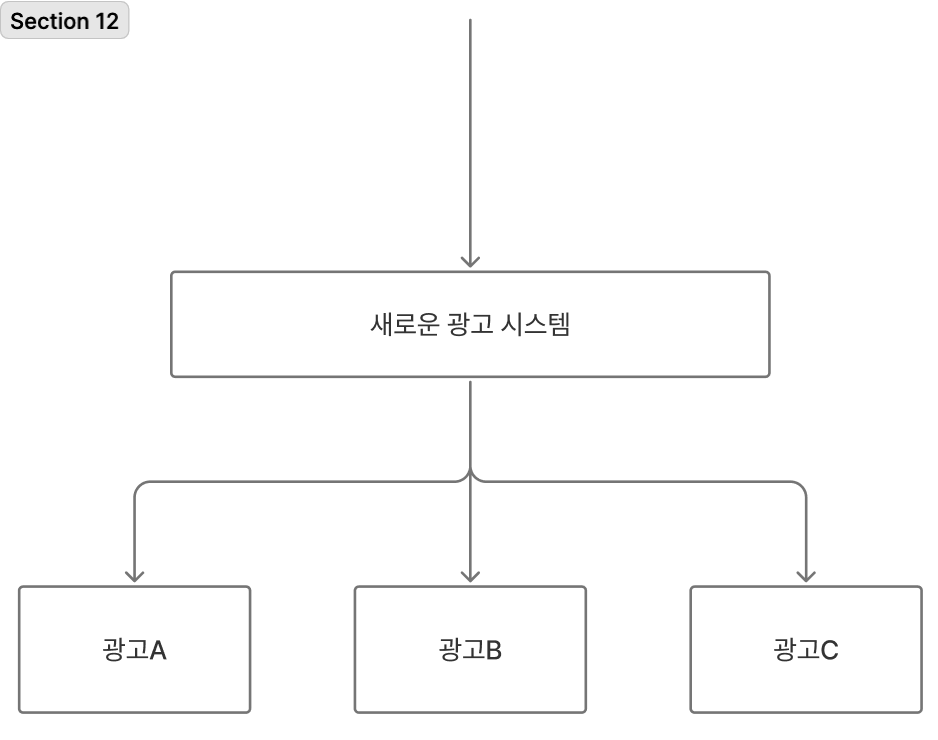
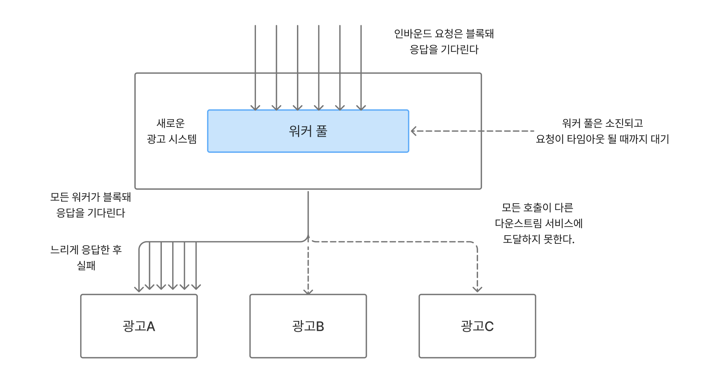
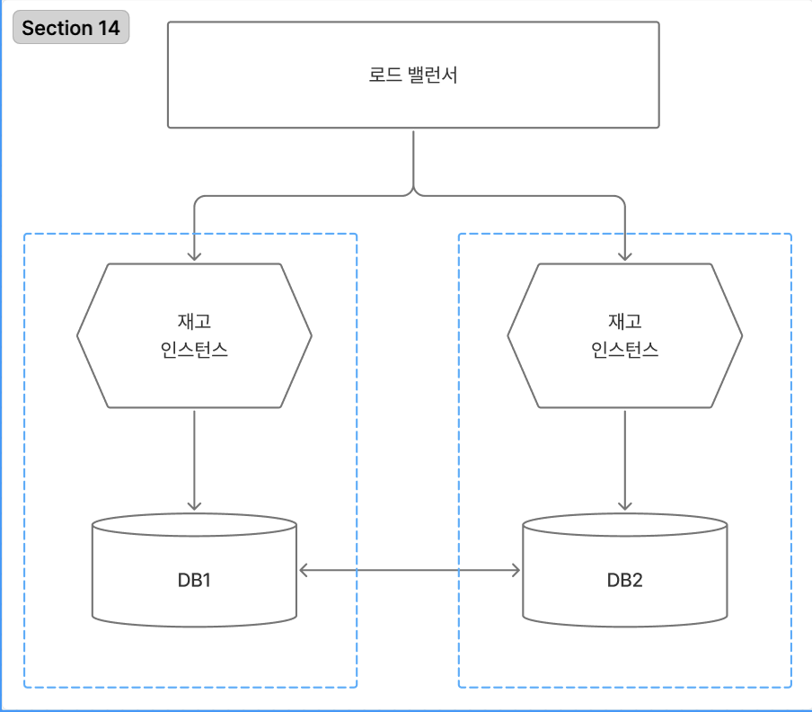

# 12장 - 회복 탄력성

## 1. 회복 탄력성이란?

회복 탄력성에는 네 가지의 개념이 있다.

- 견고성
- 회복성
- 원만한 확장성
- 지속적인 적응력

### 견고성

예상되는 문제를 수용하기 위해 소프트웨어와 프로세스에 메커니즘을 구축하는 개념

- 직면할지도 모르는 변동의 종류를 잘 이애하고 이러한 문제가 발생할 때 시스템이 잘 처리할 수 있도록 조치를 취하는 것
- 견고성 개선을 위해 여러 복잡한 문제가 추가될 수 있으므로 주의해야 한다.

### 회복성

중단으로부터 얼마나 잘 복구되는가?

### 원만한 확장성

책임이 집중되지 않고, 조직 전체에 분산하면 예기치 못한 상황에 더 잘 대비할 수 있다.

시스템을 확장성있게 설계하고 예상치 못한 상황에 대처하는 능력은 이러한 상황이 발생했을 때 대처할 수 있는 적절한 기술, 경험, 책임감을 갖춘 사람을 배치하는 것이다.

### 지속적인 적응력

미래의 회복 탄력성을 위해 하는 일에 지속적으로 적응시키기 위해 스스로 노력해야 한다.

## 2. 장애는 어디서나 발생한다.

모든 것은 실패할 수 있고, 실패할 가능성이 있는 상황을 이해하는 것이 시스템의 견고성을 개선하는 핵심이다.

## 3. 얼마나 많아야 너무 많은건가?

얼마나 많은 실패를 허용할 수 있는지 또는 시스템이 얼마나 빨라야 하는지는 시스템의 사용자에 의해 결정된다.

부하와 실패를 더 잘 처리하기 위해 시스템을 확장할지 여부와 그 방법으 고려할 때에는 아래와 같은 요구사항을 이해해야 한다.

### 응답시간/지연시간

다양한 연산을 수행하는데 시간이 얼마나 걸리는가?

- 부하 증가가 응답 시간에 어떤 영향을 주는지 이해하기 위해 다양한 사용자 수로 측정하는 것이 유용할 수 있다.
- 네트워크의 특성상 항상 이상값이 있으므로 모니터링 되는 응답의 특정 백분위수에 대한 목표를 설정하면 도움이 된다.

### 가용성

서비스가 다운될 것을 예상할 수 있는지, 연중무휴로 가동되어야 하는지 고려해야 한다.

### 데이터 내구성

데이터 손실은 어느 정도까지 허용되는가?

## 4. 기능 저하

가동되거나 중단될 수 있는 여러 다른 마이크로서비스에 기능이 분산되어 있는 경우, 기능을 안전하게 저하시킬 수 있는 능력이다.

- 각 장애의 영향도를 파악하고 기능을 적절히 저하시키는 방법을 찾아야 한다.
  - ex ) 재고 수준 파악이 어려우면 판매를 계속 진행하고 세부 사항을 나중에 해결

## 5. 안정성 패턴

무언가가 잘못되었을 때 심각한 파급효과를 피할 수 있는 패턴을 적극 고려해야 한다.

- 한 명의 나쁜 시민이 전 세계를 무너뜨리는 일이 없어야 한다.

### 애드버트코프 사례

#### 배경 설명

애드버트코프의 시스템은 아래와 같이 교살자 무화과 패턴을 사용하고 있었다.

#### 문제 발생

이 서비스 전체가 마비되는 일이 있었는데 원인은 광고A 이 매우 느리게 응답하여 문제가 발생한 것이었다. 하지만 실패의 원인이 무엇이든 하나의 실패로 모든 시스템이 마비되는 취약한 시스템을 만들었다.

#### 원인 분석

원인 분석 결과 아래와 같은 문제들이 있었다.

- 다운스트림 연결을 위해 HTTP커넥션 풀을 사용하고 있어 풀에 있는 스레드에는 다운 스트림 HTTP 호출을 수행할 때 대기하는 시간이 타임아웃이 설정되어 있었다.
  - 문제는 느린 다운 스트림 서비스로 인해 워커가 모두 타임아웃까지 대기를 해야 했다.
  - 대기하는 동안 워커 스레드를 필요로 하는 요청이 워커 풀로 유읻뵈었고, 가용할 워커가 없어 요청 자체가 계속 hang이 걸린 상태였다.

#### 해결

**세가지 수정 사항**

- 타임아웃 설정
- 벌크 버드
- 회로 차단기(서킷 브레이커)

### 타임아웃

다운 스트림 서비스에 대한 호출을 포기하기 전에 얼마나 기다려야 하는가?

- 애드버트코프의 경우 HTTP 요청 풀에 타임아웃이 누락되면 다운스트림 HTTP요청을 위해 워커를 요구할 때 워커가 가용해질 때까지 요청 스레드가 블록됨
  - 불필요하게 긴 타임아웃 시간을 줄여 해결
  - 해당 작업 전체에 대해 대한 타임아웃을 생각하고 전체 타임아웃 예산이 초과하면 연산 전체를 중단해야 한다.

### 재시도

일시적인 문제의 경우 재시도로 해결할 수 있다.

- HTTP 상태값의 경우 404가 반환되면 재시도가 도움이 되지 않겠지만, 503, 504의 경우 재시도를 하는 것이 유용하다.
- 재시도하기 전 지연 시간이 필요할 수 있다.

### 벌크헤드

실패로부터 격리하는 방법을 뜻한다.

- 각각 다른 다운스트림 마다 커넥션 풀을 사용하면 서로를 분리할 수 있다.
- 관심사 분리
- 자원이 더 포화되지 않도록 특정 조건에서 요청을 거부할 수 있도록 한다.(로드 셰딩)

### 회로 차단기(서킷 브레이커)

회로 차단기로 일정 횟수 이상 실패 시 차단기를 끊고 일정 시간이 지난 후 몇 개의 응답을 보내어 정상 작동 시 회로 차단기를 재설정

- 회로 차단기가 끊어진 상황에서 메시지 큐에 요청을 넣고 나중에 재시도할 수 있다.

### 격리

미들웨어나 다른 종류의 호출 버퍼링 시스템으로 문제가 된 다운스트림 서버를 오프라인으로 만들어 업스트림의 파급력을 줄일 수 있다.

### 이중화

이중화를 통해 하나의 인스턴스에 장애가 발생해도 필요한 기능을 제공할 수 있다.

- 위험 분산을 위해 각각의 인스턴스는 서로 다른 가용영역에 배치해야 하낟.

### 미들웨어

미들웨어를 통해 메시지 전송을 보장할 수 있다.

### 멱등성

첫번째 적용 이후 연산을 여러번 해도 결과가 변경되지 않는 것을 뜻한다.

- 멱등성을 통해 호출을 여러번 해도 부정적인 영향을 없엘 수 있다.

## 6. 위험 분산

회복 탄력성을 위해 모든 달걀을 한 바구니에 담지 않아야 한다.

## 7. CAP 정리

분산 시스템에서는 일관성(consistency), 가용성(availability), 단절내성(partition tolerance)라는 세가지 조건을 서로 절충할 수 있다.

실패 모드에서 두가지 조건을 유지하게 된다.

### 일관성 희생 (AP)

장애가 발생하는 경우 **단절**됨에도 시스템이 실행되고 시스템이 여전히 실행할 수 있다는 점에서 시스템이 **가용**하지만 일관성이 보장되지 않는다는 점에서 세가지 특징을 모두 유지하지는 못한다.

현실적으로 데이터가 바로 복제되지는 않지만, 단절내성과 가용성을 위해 일관성을 양보하는 시스템은 최종 일관성이 있다고 한다.

- 미래의 어느 시점에는 데이터가 업데이트 되나 한번에 이루어 지지 않아 이전 데이터를 볼 가능성을 감수해야 한다.

### 가용성 희생 (CP)

각각의 노드가 단절된 경우 일관성을 보장하기 위해 서로 조율할 수 없다.
이때 일관성을 유지할 수 있는 유일한 방법은 요청에 대한 응답을 거절(가용성 희생)하는 것이다.

여러 노드에서 일관성을 유지하는 것은 매우 어렵다.
하나의 노드에서 읽기가 진행되는 동안 다른 노드에서 업데이트가 일어나면 안된다. 즉, 일관성 보장을 위해 여러 데이터베이스 노드에 걸쳐 트랜잭션 읽기를 해야 한다. 이로 인해 전체 시스템이 블록될 수 있다.

### 단절내성 희생

CA 시스템은 분산시스템에서 존재하지 않는다.

### 양자 택일이 아니다

시스템 전체가 AP, CP일 필요는 없다.
일관성과 가용성의 양자택일 보다는 각각의 상황에 따라 절충안을 찾을 수 있다.

### 현실

시스템이 아무리 일관성을 유지한들 모든 상황을 다 알 수 없다.

## 8. 카오스 엔지니어링

실환경에서 격동적인 조건을 견뎌내는 시스템의 능력에 대한 신뢰를 구축하기 위해 시스템을 실현하는 분야이다.

## 9. 비난

일이 잘못되었을 때 비난하는 것은 사람들이 문게가 발생했을 때 나서서 말하지 않게 되는 두려움 문화가 생길수 있다.
비난없는 회고와 공정한 문화
