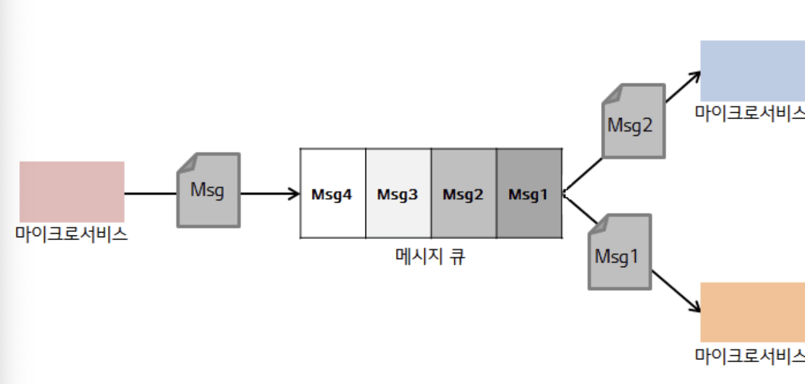

# 13장 - 확장

## 1. 확장의 네가지 축

- 수직 확장
- 수평 복제
- 데이터 파티셔닝
- 기능 분해

### 1.1 수직 확장

- 더 큰 머신을 사용하는 방법
- 관계형 데이터베이스에서 쓰기 성능을 신속하게 확장시킬 수 있다.

**구현**

- 더 큰 하드웨어 여분이 없다면 클라우드 제공업체를 고려해볼 수 있다. (AWS)

주요 이점

- 가상화된 인프라스트럭쳐의 경우 빠르고 위험 부담없이 시도할 수 있다.
- 운영체제와 칩셋이 동일하게 유지되면 하부의 더 큰 인프라스트럭쳐를 활용하고자 코드나 데이터베이스를 변경할 필요가 없다.

제한 사항

- 소프트웨어가 멀티코어를 고려하지 않고 작성된 경우 확장에 한계가 있을 수 있다.
- 해당 서버가 다운되면 모든 기능이 죽는다.
- 비용에 비례하여 사용가능한 자원이 증가하지는 않는다.

### 1.2 수평 복제

구현

- 로드밸런서를 통해 여러 기능 복제본으로 요청을 분산
- 경쟁 소비자 패턴 : 여러 소비자가 동시에 메시지 큐에 있는 메시지를 처리할 수 있도록 하는 설계 패턴

  
  [https://xzio.tistory.com/2027](https://xzio.tistory.com/2027)

- 읽기 복제본을 활용한 수평 복제

주요 이점

- 부하를 분산하는 작업은 다른 곳, 메시지 브로커에서 실행되는 큐나 로드 밸런서를 통해 수행될 수 있으므로 애플리케이션을 업데이트해야 하는 경우는 거의 없음

제한 사항

- 인프라스트럭쳐 비용 증가
- 부하 분산 매커니즘에 의존해 작업을 수행해야 하므로 이 매커니즘의 작동 방식과 선택한 특정 방법의 제한 사항을 파악해야 한다.

### 1.3 데이터 파티셔닝

- 워크로드와 관련된 키를 가져와 그 키에 함수를 적용하고 그 결과로 얻은 파티션에 부하를 분산
- 데이터베이스 수준에서 그치지 않고 인스턴스 수준에서의 파티셔닝도 가능하다.
  - 프록시를 통해 분산을 하면 된다.
  

주요 이점

- 데이터 파티셔닝은 트랜잭션 워크로드에 유용하게 확장 가능하다.
- 여러 파티션을 생성하면 유지 보수 활동의 영향도와 범위를 더 쉽게 줄일 수 있다.

제약사항

- 하나의 파티션에 장애가 발생하면 부분 요청 실패로 이어진다.
- 하나의 파티션에 편중될 가능성이 있다. (이름…)
  - 고객에 부여된 고객ID를 기반으로 파티션을 분할하면 균등하게 분배를 할 수 있다.
- 데이터가 여러 파티션에 산재되어있는 경우 각 개별 샤드를 조회하고 메모리에 조인

### 1.4 기능 분해

- 기능을 분해하려면 기능을 추출해 독립적으로 확장할 수 있다.

주요 이점

- 기본 인프라스트럭쳐 크기를 적절하게 조절할 수 있다.

제한 사항

- 단기간에 이점 제공이 어렵다.
  - 상당한 공수가 들음

## 2. 결합 모델

- 확장 육면체의 주요 요인 중 하나는 한가지 유형의 확장으로 좁게 생각하는 것을 지양하고 필요시 여러 축에 따라 애플리케이션을 확장해야 한다.
  - 주문 서비스를 여러 복제본으로 분리 확장한 후, 서로 다른 지리적 위치에 따라 서로 다른 샤드로 분리를 할 수 있다.

## 3. 작게 시작하라

- 존재하지도 않은 문제로 시스템을 최적화하는 것은 다른 활동에 더 잘 사용할 수 있는 시간을 낭비하고 불필요하게 더 복잡한 시스템을 만드는 지름길이 될 수 있다.

## 4. 캐싱

- 마이크로서비스에서는 캐싱과 관련해 논의할 측면이 많다.

### 4.1 성능

- 마이크로서비스의 경우 네트워크 지연으로 인한 부정적인 영향과 일부 데이터를 가져오기 위해 여러 마이크로서비스와 상호작용해야 하는 비용을 우려해야 한다.
  - 캐시를 통해 네트워크 호출을 줄일 수 있어 부하 감소에 큰 도움이 된다.

### 4.2 확장성

- 읽기를 캐시로 전환하여 시스템 일부에서 발생하는 경합을 피할 수 있다.

### 4.3 견고성

- 원본이 가용하지 않은 상황에서도 작동이 가능하다
  - 오래된 데이터를 자동으로 제거하지 않도록 캐시 무효화 매커니즘을 구성하고 업데이트할 수 있을때까지 캐시를 보관하고 있어야 한다.

### 4.4 캐싱 위치

**클라이언트 측 캐싱**

- 클라이언트 측 캐싱 시 데이터가 원본의 범위에 벗어난 곳에 캐싱된다.
  - 추가적인 네트워크 호출을 피할 수 있다.
  - 무효화 매커니즘에 관련된 선택 범위가 줄어든다.
  - 캐싱이 늘어나면 원본과 불일치가 늘어날 수 있다.
    - 클라이언트 측 캐시를 공유하거나 레디스를 통해 전용 캐시 도구를 사용하여 해결할 수 있다.
      - 이로 인해 불일치를 방지하고 관리해야 하는 데이터 복사본이 줄어든다.
      - 클라이언트는 공유 캐시도 왕복해야 한다.

**서버 측 캐싱**

- 정교한 캐시 무효화 알고리즘이 가능해진다.
  - write-through cache의 경우 이와 같은 상황에서 구현이 쉽게 됨
  - 캐싱으로 인해 소비자가 마이크로서비스까지 왕복해야 되어 속도 향상에 제약이 있다.

요청 캐싱

- 원본 요청에 대해 응답을 캐싱하여 저장한다.
- 특정 요청의 결과만 캐싱된다.

### 4.5 무효화

- 캐시에서 데이터를 제거하는 과정
- 어떤 상황에서 캐시를 제거해야 하는지 중요하다.
  - 새로운 데이터가 업데이트 되는 경우
  - 캐싱된 복사본이 오래 되었다고 가정하고 원본을 가져오는 경우

**TTL**

- 특정 시간 동안만 유효한 것으로 간주
  - HTTP는 TTL(Cache-Control) 헤더와 응답의 Expires 헤더를 통해 만료 타임스탬프 설정이 가능하다

**조건부 GET**

- HTTP로 직접 작업 시 ETag라는 다른 기능이 있다.
  - ETag는 리소스 값이 변경됐는지 여부를 확인하는데 사용된다.
  - 고객 레코드 업데이트 시, 자원에 대한 URL은 동일하나 값이 달라져 ETag또한 달라질 것을 기대할 수 있다.
  - GET 요청 시 추가 헤더를 통해 특정 기준이 충족되는 경우에만 클라이언트에게 자원을 내려보내도록 서비스에 지시할 수 있다.
    - Cache-Control을 통해 해당 자원이 오래된 것으로 판단되어 최신 자원을 가지러 갈 때, GET 요청 시, If-None-Match: 같은 값을 전달할 수 있다.
    - 서버에 해당 URI에 자원 요청 시, ETag값과 일치하는 자원이 있다면 가져오지 않겠다는것을 뜻함
      - 304 Not Modified
    - 물론 서버에 요청을 날려야 해서 왕복 횟수를 줄이는데 도움이 되지는 않으나 불필요하게 자원 재생성을 막을 수 있다.

**알림 기반**

- 이벤트를 통해 구독자가 로컬 캐시 항복을 무효화할지 여부를 알 수 있게 해준다.
  - 캐시가 오래된 데이터를 제공할 가능성을 줄일 수 있다.
  - 단점은 구현이 복잡함
  - 알림 매커니즘이 동작하지 않을 경우 캐시 무효화가 이뤄지지 않을 수 있다.
    - Heart-beat를 통해 알림 수신여부를 지속적으로 체크해야 한다.

**연속 쓰기(write-through)**

- 원본의 상태와 동시에 캐시가 업데이트 된다.
  - 서버 측 캐싱에서 연속 쓰기 매커니즘을 구현하면 동일한 트랜잭션 내에서 데이터베이스와 인메모리 캐시를 큰 어려움 없이 업데이트할 수 있으므로 비교적 간단해진다.

**나중 쓰기(write-behind)**

- 캐시 업데이트 이후 원본이 업데이트 되어 캐시를 버퍼처럼 사용이 가능해진다.
- 결과를 캐시에 기록해 후속적으로 발생하는 읽기를 더 빠르게 만들 수 있고 나중에 원본이 업데이트 될 것을 예상할 수 있다.
- 데이터 손실 우려가 있다.
  - 캐시자체 내구성이 떨어지면 데이터가 원본에 기록되기 전에 손실될 수 있다.

### 4.6 캐싱의 황금 법칙

- 너무 많은 곳에 캐싱을 사용하면 안된다.
  - 데이터가 오래될 수 있고 이 데이터가 최신인지 확인이 어려워진다.
  - 데이터 무효화 위치 파악이 어려워진다.
  - 데이터 신선도를 더 쉽게 추론할 수 있도록 가능한 적은 위치에 캐싱을 사용해야 한다.

## 5. 자동 확장

- 가상 호스트의 프로비저닝과 마이크로서비스 인스턴스 배포 자동화가 가능하다면 마이크로서비스를 자동으로 확장가능하다.
  - 최대 부하 시간이 9시에서 15시라면 9시 ~ 15시에는 추가 인스턴스를 불러오고 9시 이전과 15시 이후에는 추가 인스턴스를 해제하여 비용을 절감할 수 있다.
  - 부하가 증가하거나 인스턴스 장애 시, 인스턴스를 추가하고 더이상 필요하지 않은 인스턴스를 제거할수도 있다.
