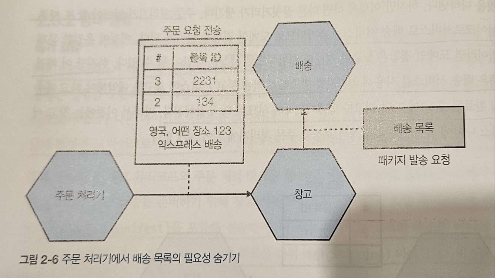

## 올바른 마이크로서비스 경계를 만드는 것은 무엇인가?

- 마이크로서비스는 결국 모듈식 분해의 또다른 형태이다.
- 마이크로서비스 경계를 구성할 때 중요한 것은 정보 은닉, 응집력, 결합도 이다

### 정보 은닉

- 정보은닉은 모듈 경계 뒤에 가능한 많은 세부 정보를 숨기려는 욕구를 나타낸다.
- 정보 은닉의 이점
  - 향상된 개발 시간 : 모듈개발을 병렬로 할 수 있다.
  - 이해도 : 각 모듈을 따로따로 살펴보고 이해할 수 있다.
  - 유연성 : 서로 독립적으로 변경이 가능하다.

### 응집력

- 관련성 있는 행동은 함께 두길 원하고 그렇지 않은 행동은 다른 곳에 두어야 한다.
- 문제 영역 내 관련 동작을 한곳으로 모으며, 다른 경계와 가능한 느슨하게 통신할 수 있는 경계를 찾길 원한다.

### 결합

- 느슨한 결합은 다른 서비스가 변경되었을 때 다른 서비스에 영향력을 줄일 수 있다.
- 하지만 결합은 다양한 형태로 나타날 수 있다.

#### 결합과 응집력의 연관성

- 응집력이 강하고 결합도가 낮으면 구조가 안정된다.
- 결합도와 응집력은 깊이 관련되어 있다.
  - 응집력은 경계 내부에 있는 사물 사이의 관계를 설명하며
  - 결합도는 경계 건너의 사물간의 관계를 설명한다.
- 코드를 구성하는데 절대적인 좋은 방법은 없으므로 결합도와 응집력의 적절한 균형을 잡아야 합니다.

## 결합 유형

- 결합 유형에는 도메인 결합, 통과 결합, 공통 결합, 내용 결합이 있다.
- 도메인 결합이 결합도가 가장 낮고, 내용 결합이 결합도가 가장 높다.

### 도메인 결합

- 도메인 결합은 첫번째 마이크로서비스가 다른 마이크로 서비스가 제공하는 기능을 사용하기 위해 서로 상호작용해야 하는 상황을 설명한다.
- 주문 처리기는 창고 서비스가 제공하는 기능과 결제 서비스가 제공하는 기능을 사용하기 위해 창고 서비스와 결제 서비스를 각각 호출한다.

- 이러한 상호작용은 불가피하나 되도록이면 적게 유지해야 한다.
  - 하나의 마이크로서비스가 너무 많은 작업을 수행하게 되어 문제가 발생할 수 있다.
  - 최소한의 정보만을 통신해야 한다(정보 은닉)

### 통과 결합

- 데이터가 다른 하위 마이크로서비스에 필요하다는 이유만으로 하나의 마이크로서비스가 다른 마이크로서비스에게 데이터를 전달하는 상황을 뜻한다.
- 주문 서비스가 주문 발송을 위해 창고 서비스로 요청을 보낼 때, 물품에 해당하는 ID뿐만이 아닌, 배송 서비스에게 필요한 데이터까지 전송하고, 창고 서비스가 주문 서비스에게 받은 배송 목록을 배송 서비스에게 전달하는 상황이다.

- 이의 경우 하위에 데이터를 변경하면 상위에 더 큰 변경을 일으킬 수 있다.

- 이를 해결하기 위해 마이크로서비스가 중간자를 우회하는 것이 합당한지 고려해야 한다.
  - 하지만 이는 주문 처리기가 알아야 하는 또다른 마이크로서비스가 늘어나 도메인 결합을 늘리게 된다.

- 창고서비스가 제약의 일부로 필요한 정보를 받은 다음 창고에서 배송 목록을 만들어 배송 서비스에게 전달하는 방식으로 해결할 수 있다.

### 공통 결합

- 둘 이상의 마이크로서비스가 공통 데이터 집합을 사용할 떄 발생한다.
  - ex) 둘 이상의 마이크로서비스가 같은 데이터베이스를 바라볼 떄
- 만약 스키마가 하위 호환되지 않는 방식으로 변경되면 데이터베이스의 모든 소비자(마이크로서비스)를 변경해야 한다.
- 또한 리소스 경합 문제를 일으킬 수 있다.(공유 리소스에 과부하가 걸릴 수 있다.)

- 하나의 마이크로서비스가 주문 상태를 관리하게 해야 한다.

### 내용 결합

- 상위 서비스가 하위 서비스의 내부까지 도달해 서비스의 내부 상태를 변경하는 상황을 뜻한다.
- 소유권의 경계선이 명확하지 않아 개발자가 시스템을 변경하기 어려워진다.
- 주문 처리기가 주문 서비스에게 요청을 전송해 상태 변경과 어떤 상태 전환이 가능한지 확인하는 책임을 위임하고, 창고 서비스는 주문 서비스를 우회하여 주문 데이터가 저장된 데이터베이스를 바라보는 경우, 창고 서비스의 상태 변경 확인 방식이 주문 서비스의 방식과 달라 주문 데이터가 혼동될 수 있다.
- 또한 주문 테이블 내부 구조가 외부로 노출 될 수 있다.

## 도메인 주도 설계 만큼

- DDD의 핵심 개념
  - 보편 언어 : 의사소통을 돕기 위해 코드와 도메인 설명에 사용할 공통 언어를 정의하고 채택한다.
  - 애그리거트 : 객체들의 집합이며 실제 세계 개념과 관련된 하나의 개체로 관리한다.
  - 경계 콘텍스트 : 더 큰 범위의 시스템에 대한 기능을 제공하나, 복잡성을 숨기는 비즈니스 도메인 내부의 명시적인 경계이다.

### 보편 언어

- 실제 세계의 언어를 코드에 적용하여 다양한 직군의 사람들과 소통을 원활하게 해준다.

### 에그리거트

- 실제 도메인 개념
- 주문 애그리거트 내부에는 여러 품목 행이 포함될 수 있고, 품목들은 전체 주문 애그리거커의 일부로만 의미가 있다.
- 애그리거트는 하나의 마이크로서비스에서 관리되어야 한다.
- 애그리거트는 시스템의 일부로 관리될 상태, 고유함, 수명주기를 가진 것으로 생각해야 한다.
- 하나의 마이크로서비스는 하나 이상의 서로 다른 애그리거트를 관리한다.
  - 만약 다른 서비스의 기능이 애그리거트 중 하나를 변경하려는 경우, 해당 애그리거트에 직접 요청을 보내거나 애그리거트 스스로 다른 구성요소와 상호작용하여 상태 전환이 이루어지도록 해야 한다.

### 경계 콘텍스트

- 일반적으로 보다 큰 구조적 경계를 나타낸다.
- 경계의 범위 내에 명시적인 책임을 수행할 필요가 있다.
- 경계 컨텍스트는 구현 세부 사항을 숨긴다. 이로 인해 외부에서는 내부의 고려사항을 알 필요가 없다.

> 경계 컨텍스트는 하나의 책임을 가진 영역으로 어떤 비즈니스 용어의 의미, 로직, 규칙 구현 방식이 그 경계 내에서만 유효하도록 만든다. (다른 경계와 섞이지 않게 명확히 선을 긋는다.)
> 예로 들어 결제 컨텍스트 내에서는 [카드 결제 요청, 결제 승인 여부 확인, 결제 이력 저장...] 등의 업무가 일어나는데, 이는 결제 컨텍스트에만 중요한 로직이고 외부(상품 컨텍스트, 배송 컨텍스트)는 내부에 어떤 일이 일어나는지 알 필요가 없다.

#### 은닉 모델

뮤직코프의 경우 재무부서와 창고를 2개의 경계 컨텍스트로 구분할 수 있다.

재무부서는 창고의 자세한 내용을 알 필요가 없으나 계정을 최신 상태로 유지하려면 재고 수준을 알 필요가 있다.

마찬가지로 계정 원장 항목은 재무에 필수적이나 외부에 공유되지 않는다.

하지만 기업 가치를 계산하려면 재고에 대한 내용이 필요하므로 재고 품목은 두 콘텍스트 간의 공유 모델이 된다.

하지만 재고 품목의 모든 것을 노출시킬 필요가 없다.

이를 위해 내부전용 표현과 노출용 외부 표현이 존재한다.

#### 공유 모델

둘 이상의 결계 콘텍스트에서 나타나는 개념도 존재할 수 있다.

재무 콘텍스트와 창고 콘텍스트는 모두 재고 품목에 대해 알아야 한다.
재무부서는 회사 가치를 평가하기 위해 알아야 하고 창고부서에서는 발송할 주문을 포장하기 위해 실물을 찾을 수 있도록 알아야 한다.

이와 같이 공유 모델은 서로 다른 경계 콘텍스트에서 다른 의미를 가질 수 있어 다른 이름으로 불릴 수 있다.
(창고부서에서는 재고 품목이라는 이름을 사용하고 재무부서에서는 자산이라고 부를 수 있다.)

이로 인해 여전히 두 부서의 로컬 개념을 모두 해당 품목의 글로벌 개념에 연결해야 할 수 있다. 이를 관리하기 위해 공유 모델에서는 일부 내용을 숨길 수 있다.

### 애그리거크와 경계 콘텍스트를 마이크로서비스에 매핑

애그리거트와 경계 컨텍스트는 외부의 더 넓은 시스템과 상호작용 하기 위해 잘 정의된 인터페이스로 응집력의 단위를 제공한다. 애그리거트는 우리 시스템에서 단일 도메인 개념에 중점을 둔 독자적인 상태 기계이며, 관련된 애그리거트의 집합을 표현하는 경계 콘텍스트와 함께 더 넓은 서계에 대한 명시적 인터페이스를 사용한다.

#### 거북이 아래 거북이

마이크로 서비스 경계를 고려할 때 더 크고 대분화된 컨텍스트 관점에서 먼저 생각해본 후, 내부 컨텍스트의 이음새를 분리하여 내부 컨텍스트를 세분화한다.

심지어 하나의 마이크로서비스를 더 작은 서비스로 분해하더라도 소비자에게 더 큰 단위의 API를 제공하여 외부 세계에 이를 은닉할 수 있는 방법이 있다. (하나의 마이크로서비스가 2개의 작은 마이크로 서비스로 나누어져도 이를 외부에서는 모르게 숨길 수 있다.)

### 이벤트 스토밍

#### 프로세스

도메인 이벤트를 먼저 식별한다. (시스템에서 발생하는 일을 나타내며 관심 대상을 뜻한다.)

- ex : 주문 접수, 지불 수령 (주황색)

도메인 이벤트를 발생시키는 명령을 식별한다. (사림이 무언가를 하려고 내리는 결정)
시스템의 경계를 이해하고 시스템의 핵심이 되는 액터를 식별한다. (파란색)

애그리거트를 구분한다. (노란색)

- ex : 주문 접수 도메인 이벤트에서 주문은 잠재적으로 애그리거트가 될 수 있고, 접수는 주문에서 발생할 수 있는 부분이므로 수명 주기가 된다.
- 이로 인해 애그리거트와 애그리거트와 관련된 명령, 이벤트로 나눌 수 있다.

애그리거트가 식별되면 경계콘텍스트에 묶인다.

## 마이크로서비스를 위한 도메인 주도 설계 사례

마이크로서비스에서 DDD가 유용한 이유

1. DDD로 인해 중여한 경계 컨텍스트가 정보 은닉에 명시적으로 사용된다.
2. 공통언어를 통해 마이크로서비스 엔드포인트를 정의하는데 큰 도임이 된다.
3. 경계 컨텍스트에 따라 시스템이 분리되어 있어 변경사항이 있어도 하나의 경계 내부에서만 일어날 가능성이 높다

## 비즈니스 도메인 경계에 대한 대안

경계를 찾을 때 고려해야 할 다른 요소

1. 변동성
2. 데이터
   - 보유하고 관리할 데이터 특징에 대해 다양한 형태의 분해가 발생할 수 있다.
3. 기술
   - 다른 기술을 사용해야 할 때 경게를 찾는 요소가 될 수 있다.
4. 조직
   - 하나의 마이크로서비스를 두 조직에서 소유하는 것은 어려운 일이다. 경계를 정의할 때 조직의 구조를 염두에 두어야 하낟.
