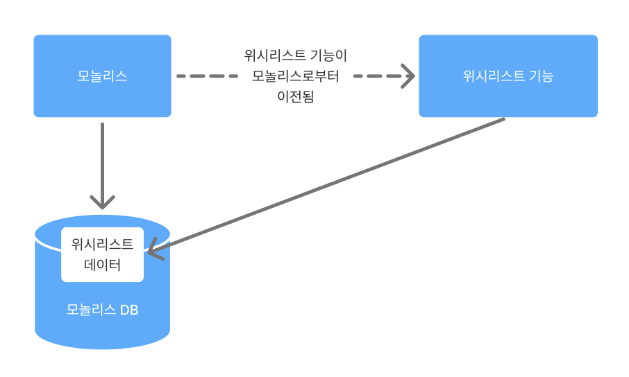
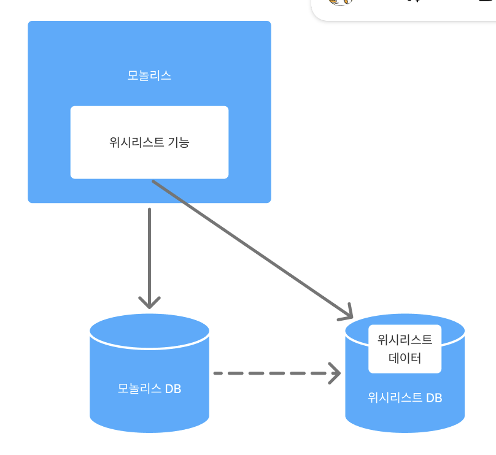
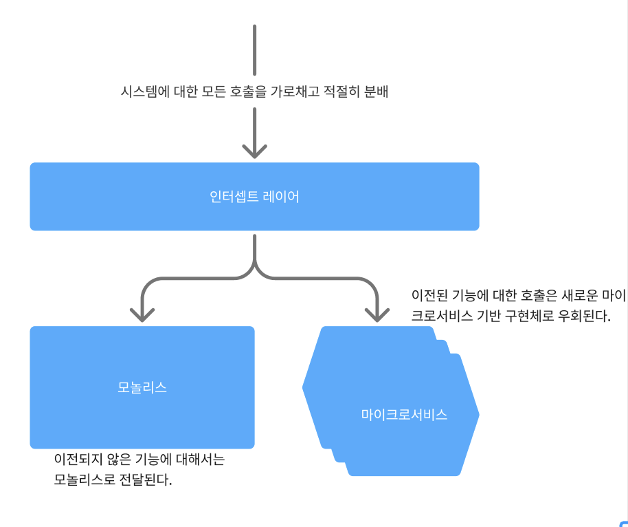
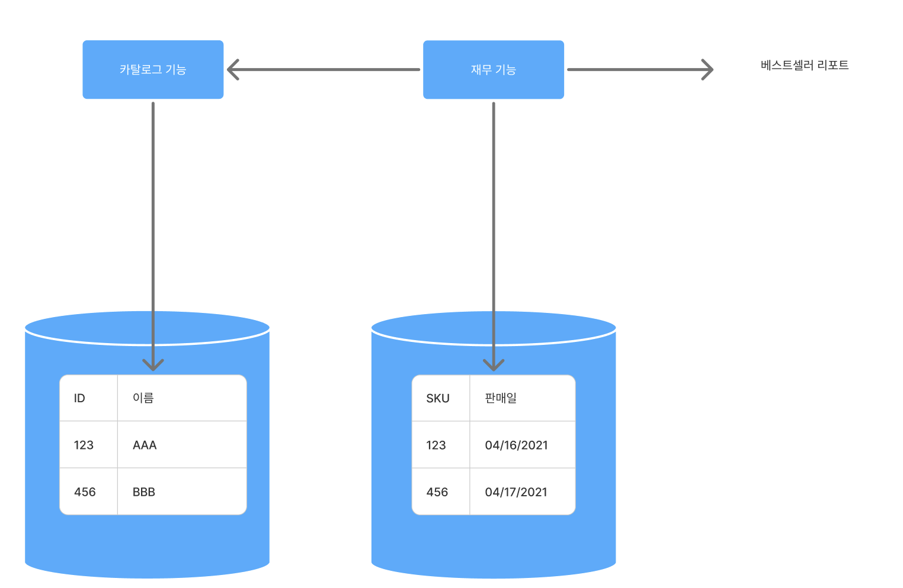

# 3장 - 모놀리스 분해

## 1. 목표를 가져라

- 마이크로서비스는 목표가 아니다. 현재 아키텍처로 최종 목표를 달성하는 더 쉬운 방법이 없는 경우에만 마이크로서비스 아키텍처로의 마이그레이션을 고려해야 한다.
- 마이크로서비스를 만드는 데만 집착하면 안된다.

## 2. 점진적 마이그레이션

- 마이크로서비스 아키텍처로 마이그레이션을 하기로 결정했다면 모놀리식을 한번에 조금씩 떼어내는 것이 좋다.

## 3. 모놀리스가 적인 경우는 드물다.

- 모놀리스 아키텍처는 본질적으로 나쁘지 않기 때문에 적으로 간주하면 안된다.
- 모놀리스가 없는 것에 집중하지 말고 대신 아키텍처 변경이 가져올 혜택에 집중해라

## 4. 무엇을 먼저 나눌까?

- 시스템의 변동성을 살펴보고 가장 자주 변경되는 기능을 찾아내 마이크로서비스로 동작하는지 확인해라
- 어떤 기능을 마이크로서비스로 분할할지 결정하는 것은 마이크로 서비스로 추출하는 작업의 용이성과 추출의 이점 사이의 균형에 따라 결정될 것이다.
- 쉬운 것부터 시작하고, 추출 시도 실패 시 마이크로서비스가 여러분에게 맞는지 다시 고려해보아야 한다.

## 5. 계층별 분해

1. 코드 우선 분해

- 먼저 코드레벨에서 분해를 진행하는 방법(데이터 분리를 나중에)
- 데이터베이스 분해보다 쉬운 경향이 있다.
  - 하지만 코드레벨에서 분리가 되어도 데이터베이스에서 분리가 되지 않는 경우가 있으므로 관련 데이터 저장소를 살펴보고 데이터 추출이 가능할지, 어떻게 진행할지에 대한 아이디어를 가지고 있어야 한다.

1. 데이터 우선 분해

- 데이터를 깔끔하게 분리가 가능한지 불확실한 상황에서 유용하다.
- 마이크로서비스의 전체 추출 위험을 피할 수 있다.
- 분해로 인한 데이터 무결성 손실, 트랜잭션 작업 부족과 같은 문제는 사전에 처리해야 한다.

## 6. 유용한 분해 패턴

### 6.1 교살자 무화과 패턴

- 인터셉트 레이어를 통해 기존 시스템에 대한 호출을 가로챈다.
- 새로운 마이크로 서비스 아키텍처에서 해당 기능에 대한 호출이 구현되면 해당 마이크로서비스로 리디렉션 한다.
- 이 패턴의 장점은 모놀리식 어플리케이션을 변경하지 않고도 수행할 수 있다는 것이다.

### 6.2 병렬 실행

- 모놀리스식 기능 구현과 새로운 마이크로서비스 구현을 나란히 실행해 같은 요청을 제공하고 결과를 비교한다.

### 6.3 기능 토글

- 제품 기능을 끄거나 치고 아니면 기능에 대한 2개의 다른 구현 사이를 오가게 하는 매커니즘
- 전환하는 동안 모놀리스에 그대로 두고, 기능 버전간 전환하는 수단이 필요하다.
  - ex) 프록시 레이어

## 7. 데이터 분해에 대한 우려

### 7.1 성능

- 모놀리스에서 사용한 JOIN을 사용할 수 없어 속도가 빨라지긴 힘들다.
- 마이크로 서비스에서는 재무 서비스에서 카탈로그 서비스를 호출한 후, 카탈로그 서비스에서 카탈로그 DB에서 조회한 데이터를 다시 재무 서비스로 호출해주어야 한다.

- 이를 해결하기 위해 마이크로서비스에서 필요한 데이터를 대량으로 호출하거나 로컬에 캐싱하여 문제를 어느정도 해결할 수 있다.

### 7.2 데이터 무결성

- 기존 모놀리스 데이터베이스에서는 외래키로 테이블 간 관계를 정의할 수 있어 무결성이 보장되었다.
- 하지만 데이터베이스가 분리된 마이크로서비스에서는 모델의 무결성을 강제할 수 없다.

### 7.3 트랜잭션

- 여러 데이터베이스에 걸쳐 데이터를 분해하면 트랜잭션의 안정성을 잃게 된다.
- SAGA 패턴

### 7.4 도구

- 데이터베이스 변경시 사용할 수 있는 도구가 제한되어 있다.
- 플라이웨이, 리퀴베이스

### 7.5 리포팅 데이터베이스

- 외부 액서스용 전용 데이터베이스를 만들고 마이크로서비스 내부 저장소의 데이터를 외부에서 액서스 가능한 리포팅 데이터베이스를 활용하면 내부 데이터 저장소에 대한 액서스를 숨길 수 있다.
- 리포팅 데이터베이스에는 최소한의 데이터만 노출되어야 한다.
- 리포팅 데이터베이스를 다른 마이크로서비스 엔드포인트와 동일하게 취급해야 한다.
